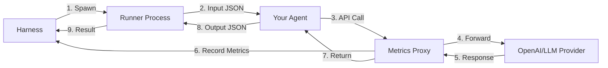

<h1 align="center">AgentBench</h1>

<p align="center">
  <strong>Benchmark Harness for LLM Agents</strong>
</p>

<p align="center">
  <i>Stop playing whack-a-mole with your benchmarks.</i>
</p>

<p align="center">
  <a href="https://github.com/fastpaca/agentbench/stargazers">
    
  </a>
</p>

---

## The Problem

Running benchmarks locally is a nightmare. You start a run, walk away, and come back to find it failed at 20% because of a single API timeout or a bad JSON response.

You end up with spaghetti scripts, manually tracking which cases failed, re-running them one by one, and trying to stitch the results back together. It's fragile, frustrating, and wastes hours of engineering time.

You don't need an enterprise platform that takes weeks to integrate. You need a tool that works.

## The Solution

AgentBench is a harness built for the reality of agentic LLM development. It handles the messy parts of benchmarking so you can focus on your agents.

* **It doesn't crash.** Agents run in isolated processes. If one crashes, the harness records the failure and keeps moving.
* **It remembers where it left off.** State is saved after every single case. If you kill the process or your machine restarts, you resume exactly where you stopped.
* **It handles the retry loop.** Run the suite, let it finish, then run `agentbench retry` to target only the failures. No manual stitching required.
* **It measures reality.** A built-in proxy sits between your agent and the LLM provider to track exact latency and token usage—no more guessing or relying on self-reported metrics.

[Documentation](docs/) | [Examples](examples/) | [Issues](https://github.com/fastpaca/agentbench/issues)

---

## Quick Start

```bash
pip install agentbench
```

Initialize a new project:

```bash
agentbench init
```

Run the benchmark:

```bash
agentbench run
```

If you see failures, retry just the failed cases:

```bash
agentbench retry
```

View the final report:

```bash
agentbench analyze
```

---

## Configuration

Define your entire benchmark in one `agentbench.yaml` file. Configure it once, run it forever.

```yaml
name: memory-benchmark
description: Evaluating long-term memory capabilities
version: "1.0.0"

config:
  concurrency: 4
  timeout_seconds: 60

agents:
  - name: "mem0-agent"
    command: "python agents/mem0_agent.py"
    env:
      OPENAI_API_KEY: "${OPENAI_API_KEY}"

datasets:
  - name: "membench"
    source: "git:https://github.com/import-myself/Membench.git"
    prepare: "python scripts/prepare_membench.py"
    input_map:
      input: "question"
      expected: "ground_truth"
    evaluator:
      type: "llm_judge"
      model: "gpt-4o-mini"

output:
  directory: "./runs"
```

---

## Agent Interface

No complex SDKs. Your agent just needs to read JSON from stdin and write JSON to stdout.

| Input (STDIN) | Output (STDOUT) |
|---------------|-----------------|
| `{"case_id": "1", "input": "Hi"}` | `{"output": "Hello!", "error": null}` |

---

## Architecture

AgentBench isolates your code from the harness.



### Key Components

1.  **Harness**: Manages the run loop, persistence, and retries.
2.  **Proxy**: Intercepts API calls to provide ground-truth metrics (`OPENAI_BASE_URL` injection).
3.  **Runners**: Worker processes that ensure a bad agent doesn't kill the benchmark.

---

## CLI Reference

| Command | Description |
|---------|-------------|
| `agentbench run` | Execute a benchmark run. |
| `agentbench retry` | Retry failed cases from a previous run. |
| `agentbench list-runs` | List previous runs and their status. |
| `agentbench analyze` | Generate a report for a specific run. |
| `agentbench init` | Create a new project scaffold. |

---

## Contributing

We welcome contributions. See [Contributing Guidelines](CONTRIBUTING.md).

---

## License

Apache 2.0 - see [LICENSE](LICENSE)
